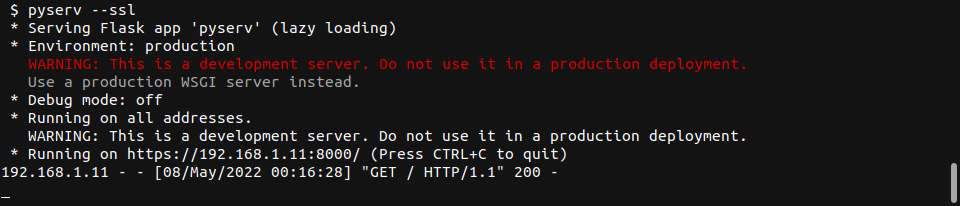
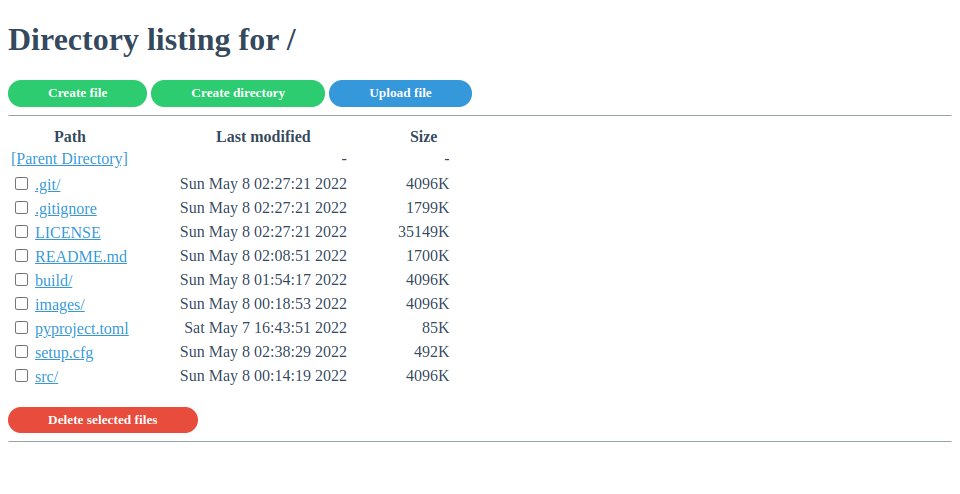

PyServ
======

Simple HTTP server to list and manipulate files.

The objective of this project is to replace the SimpleHTTPServer with a server offering more features:
- SSL encryption (HTTPS)
- Basic Authentication
- Directory listing
- File upload and download
- Files and directories creation
- Files and directories deletion





Installation
------------

Clone the repository, go inside and then:
```bash
$ python3 -m pip install .
```

Run the server
----------------

```bash
 $ pyserv -h                
usage: pyserv [-h] [-a LOGIN PASSWORD] [-b BIND] [-d DIRECTORY] [--debug] [-p PORT] [--ssl]
              [--ssl-cert SSL_CERT] [--ssl-key SSL_KEY]

Simple HTTP server to list and manipulate files

options:
  -h, --help            show this help message and exit
  -a LOGIN PASSWORD, --auth LOGIN PASSWORD
                        setup a basic authentication
  -b BIND, --bind BIND  specify alternate bind address [default: all interfaces]
  -d DIRECTORY, --directory DIRECTORY
                        specify alternate working directory [default: current directory]
  --debug               enable flask debug mode
  -p PORT, --port PORT  specify alternate port [default: 8000]
  --ssl                 enable SSL encryption
  --ssl-cert SSL_CERT   specify SSL server certificate
  --ssl-key SSL_KEY     specify SSL server secret key path

```

Generate SSL certificates
-------------------------

```bash
$ openssl req -x509 -newkey rsa:4096 -nodes -out cert.pem -keyout key.pem -days 365
$ pyserv --ssl --ssl-cert cert.pem --ssl-key key.pem 
```
